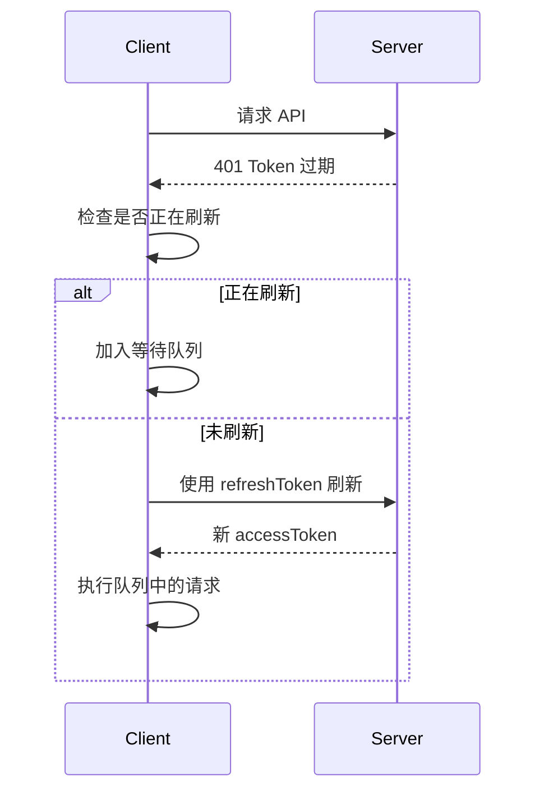

# 第4章：Axios 请求封装与拦截器

## 4.1 安装 Axios 与基础配置

### 安装

```bash
pnpm add axios
```

### 基础配置

**`src/utils/http/request.ts`**

```typescript
import axios from 'axios'

const service = axios.create({
  baseURL: import.meta.env.VITE_API_BASE_URL || '/api',
  timeout: 30000,
  headers: {
    'Content-Type': 'application/json;charset=UTF-8'
  }
})
```

---

## 4.2 请求拦截器（Token、Headers）

### 请求拦截器

```typescript
service.interceptors.request.use(
  (config) => {
    // 添加 Token
    const token = localStorage.getItem('access_token')
    if (token && !config.skipAuth) {
      config.headers.Authorization = `Bearer ${token}`
    }

    // 添加时间戳防止缓存
    if (config.method === 'get') {
      config.params = {
        ...config.params,
        _t: Date.now()
      }
    }

    return config
  },
  (error) => Promise.reject(error)
)
```

---

## 4.3 响应拦截器（统一格式、错误处理）

### 响应拦截器

```typescript
service.interceptors.response.use(
  (response) => {
    const { data } = response

    // 成功响应
    if (data.code === 0 || data.code === 200) {
      return data.data
    }

    // Token 过期
    if (data.code === 401) {
      handleTokenExpired()
      return Promise.reject(new Error('登录已过期'))
    }

    // 业务错误
    return Promise.reject(new Error(data.message))
  },
  (error) => {
    // 网络错误
    if (!error.response) {
      return Promise.reject(new Error('网络异常'))
    }

    // HTTP 错误
    const { status } = error.response
    const errorMsg = httpError(status)
    return Promise.reject(new Error(errorMsg))
  }
)
```

---

## 4.4 请求取消与重复请求防御

### 实现原理

使用 `AbortController` 取消重复请求：

```typescript
const pendingRequests = new Map<string, AbortController>()

function generateRequestKey(config): string {
  return [config.method, config.url, JSON.stringify(config.params)].join('&')
}

function cancelDuplicateRequest(config): void {
  const key = generateRequestKey(config)

  if (pendingRequests.has(key)) {
    pendingRequests.get(key)?.abort()
  }

  const controller = new AbortController()
  config.signal = controller.signal
  pendingRequests.set(key, controller)
}

function removeRequest(config): void {
  const key = generateRequestKey(config)
  pendingRequests.delete(key)
}
```

### 使用方式

```typescript
// 自动取消重复请求，无需额外配置
http.get('/api/user')
http.get('/api/user') // 第二次请求会取消第一次
```

---

## 4.5 Token 刷新机制

### 刷新流程



### 实现

**`src/utils/http/refreshToken.ts`**

```typescript
let isRefreshing = false
let requests: Array<(token: string) => void> = []

export async function handleTokenRefresh(): Promise<string> {
  if (isRefreshing) {
    return new Promise((resolve) => {
      requests.push((token) => resolve(token))
    })
  }

  isRefreshing = true

  try {
    const newToken = await refreshToken()

    requests.forEach((callback) => callback(newToken))
    requests = []

    return newToken
  } finally {
    isRefreshing = false
  }
}
```

---

## 4.6 API 模块化组织结构

### 目录结构

```
src/
├── api/
│   ├── index.ts          # 统一导出
│   ├── user.ts           # 用户 API
│   ├── auth.ts           # 认证 API
│   ├── common.ts         # 通用 API
│   └── ...
└── utils/
    └── http/
        ├── index.ts      # 导出
        ├── request.ts    # Axios 配置
        └── refreshToken.ts # Token 刷新
```

### API 模块示例

**`src/api/user.ts`**

```typescript
import { http } from '@/utils/http'
import type { ApiResponse, PageParams, PageResponse } from '@/types/api'

export interface User {
  id: number
  username: string
  nickname: string
  email: string
}

export interface UserListParams extends PageParams {
  username?: string
}

// 获取用户列表
export function getUserList(params: UserListParams) {
  return http.get<ApiResponse<PageResponse<User>>>('/user/list', { params })
}

// 创建用户
export function createUser(data: Partial<User>) {
  return http.post<ApiResponse<User>>('/user/create', data)
}

// 更新用户
export function updateUser(id: number, data: Partial<User>) {
  return http.put<ApiResponse<User>>(`/user/update/${id}`, data)
}

// 删除用户
export function deleteUser(id: number) {
  return http.delete<ApiResponse>(`/user/delete/${id}`)
}
```

### 使用方式

```vue
<script setup lang="ts">
import { getUserList } from '@/api/user'

const fetchData = async () => {
  try {
    const data = await getUserList({ page: 1, pageSize: 10 })
    console.log(data)
  } catch (error) {
    console.error(error)
  }
}
</script>
```

---

## 类型定义

**`src/types/api.d.ts`**

```typescript
/** 通用响应 */
export interface ApiResponse<T = any> {
  code: number
  data: T
  message: string
  timestamp: number
}

/** 分页参数 */
export interface PageParams {
  page: number
  pageSize: number
}

/** 分页响应 */
export interface PageResponse<T = any> {
  list: T[]
  total: number
  page: number
  pageSize: number
}
```

---

## 项目结构更新

```
src/
├── api/
│   ├── index.ts
│   ├── user.ts
│   └── common.ts
├── types/
│   └── api.d.ts
└── utils/
    └── http/
        ├── index.ts
        ├── request.ts
        └── refreshToken.ts
```

---

## 下一步

**第5章：路由系统设计与权限控制**
