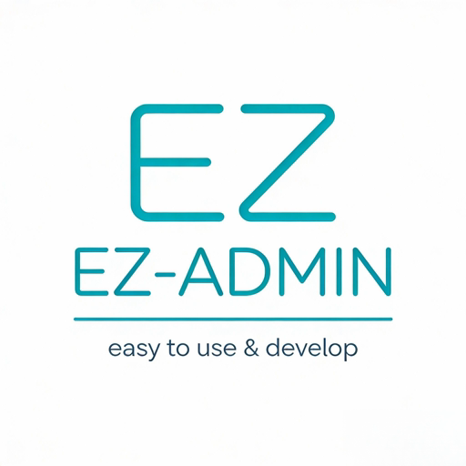

  
  
  
  
  
  

  

# 项目概述

**一款基于 Naive UI 的简单易用的后台管理系统**

EZ Admin NaiveUI 是一个专为个人开发者打造的现代化后台管理系统模板，基于 Vue 3 + Naive UI + TypeScript 技术栈，让你可以快速搭建自己的管理后台。

## 💡 项目理念

如果你不知道接下来该干什么，烦于学习更加高深的技术栈，或不想陷入源码的深渊，不妨做点自己擅长的事，加强自己的自信心。后台管理系统大家都不陌生，市面上优秀的产品也很多，有很多优点但也不乏一些弊端。

为什么不取其精华，打造一款自己的产品？无论是学习，还是便于后面工作中提高自己的工作效率，都是一个不错的选择。我一直认为，"造轮子"是对于自己掌握知识的一个全面汇总，他可以很好的体现我们的项目落地能力。

EZ-ADMIN-NAIVEUI 就是这样诞生的一个项目。EZ 取自 "easy" 谐音，体现系统简单易用的特点，这也是开发这个项目的目标之一。没有复杂的过度封装，代码整洁，逻辑清晰，可轻松上手，易于二次开发，没有任何技术负担。

## 🙏 特别鸣谢

本项目在开发过程中参考和借鉴了以下优秀开源项目的设计理念和技术实现，在此特别感谢：

- [**eladmin**](https://github.com/elunez/eladmin) - 基于 Spring Boot 的后台管理系统
- [**RuoYi**](https://gitee.com/y_project/RuoYi) - 一款基于 Spring Boot 的后台管理系统
- [**vben admin**](https://github.com/vbenjs/vue-vben-admin) - 基于 Vue3 + TypeScript 的后台管理系统
- [**Art Design Pro**](https://github.com/Daymychen/art-design-pro) - 企业级后台管理系统解决方案

## ✨ 核心特性

- ⚡ **超快响应** - 基于 Vite 构建，闪电般的启动和热更新
- 🛠 **TypeScript** - 完整的 TypeScript 支持，提供类型安全
- 🎨 **Naive UI** - 基于最新 Naive UI 组件库，设计精美，体验优秀
- 🔐 **权限控制** - 完善的动态路由和权限验证机制
- 📱 **响应式设计** - 支持移动端和桌面端自适应布局
- 🎯 **模块化架构** - 组件化、模块化开发，便于维护和扩展
- 🎨 **Tailwind CSS** - 集成 Tailwind CSS，支持自定义样式
- 📦 **Pinia 状态管理** - 现代化的状态管理方案，支持持久化
- 🔄 **动态路由** - 支持基于后端数据的动态路由生成

## 🔧 核心功能

### 🔐 用户认证

- 基于 Cookie Session 的用户认证
- 服务端 Session 状态管理
- 自动登录过期处理

### 🛡️ 权限管理

- 基于角色的权限控制
- 动态路由生成
- 菜单权限控制

### 🧭 路由管理

- 静态路由配置
- 动态路由加载
- 路由守卫保护

### ⚙️ 系统管理

- **用户管理**: 用户信息的增删改查、状态管理、角色分配
- **角色管理**: 角色配置、权限分配、用户关联
- **菜单管理**: 动态菜单配置、多级菜单支持
- **部门管理**: 部门层级管理、人员分配
- **字典管理**: 系统字典数据统一管理
- **日志管理**: 操作日志记录和系统监控
- **文件管理**: 文件上传下载和存储管理
